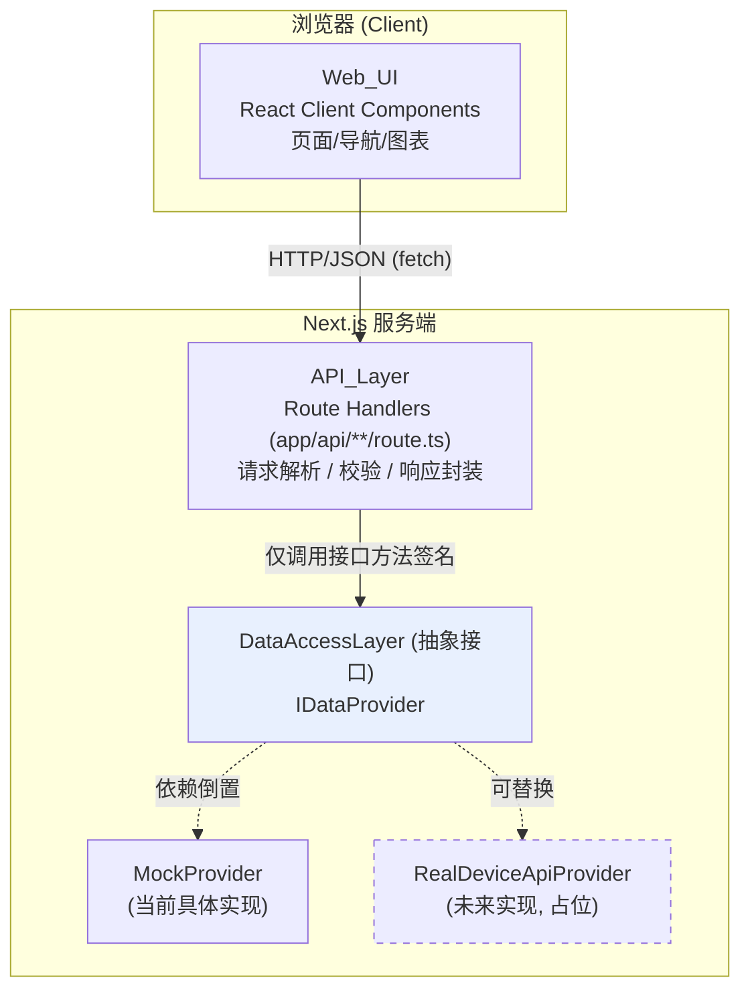
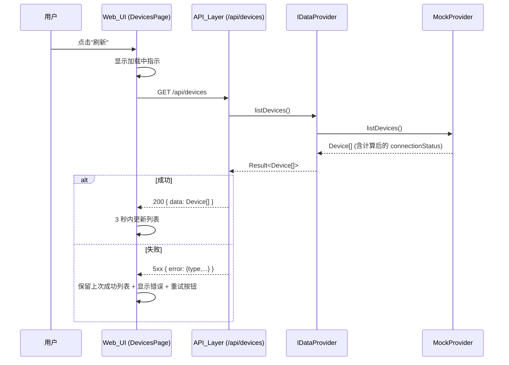

# 设计文档：家庭储能能源管理平台

## Overview

### 概述

家庭储能能源管理平台是一个基于 **Next.js（App Router）+ TypeScript** 的全栈 Web 应用，面向单一用户管理其名下的多台家庭储能设备。平台提供四项核心功能：设备连接状态监控、账户信息管理、充放电数据可视化，以及基于电价的智能电力交易自动化策略。

本设计的核心架构原则是**分层与数据来源可替换**（对应需求 5）：所有数据访问统一经由抽象的 `DataAccessLayer` 接口，当前由 `MockProvider` 实现支撑；未来接入真实设备 API 时，仅需替换该接口的具体实现，`API_Layer` 与 `Web_UI` 源代码零改动。

设计目标与对应需求映射：

| 功能区 | 对应需求 | 关键约束 |
| --- | --- | --- |
| 设备连接状态监控 | 需求 1 | 在线/离线 60 秒判定窗口；最多 200 台；3 秒内渲染；色彩+文本双重标识 |
| 账户信息管理 | 需求 2 | 字段校验（姓名 1–50、邮箱 ≤254、电话 5–20、地址 ≤200）；持久化失败保留原值 |
| 充放电数据可视化 | 需求 3 | 当日总量 + 过去 7 个连续自然日；零填充；值域 0.00–999,999,999.99 kWh；单设备/汇总切换 |
| 智能电力交易 | 需求 4 | 4 种动作；5 种比较关系；阈值 0–999999.99；单次触发去抖与重置；历史最多 50 条 |
| 可替换数据访问层 | 需求 5 | 抽象接口；结构化错误对象；Web_UI 不引用具体来源 |
| 应用框架与导航 | 需求 6 | 四个固定导航区；导航常驻；2 秒切换；加载/错误/重试状态 |

### 技术选型

- **框架**：Next.js 14+（App Router）。页面与布局使用 React Server / Client Components 组合；数据获取动作经由 Route Handlers（`app/api/**/route.ts`）暴露为 REST 风格端点。
- **语言**：TypeScript（严格模式 `strict: true`），全链路类型安全。
- **图表库**：**Recharts**（TypeScript 友好、声明式、对 React 集成度高），用于过去 7 天充放电柱状/折线图。
- **客户端数据获取**：使用轻量的 `fetch` 封装 + React hooks（可选 SWR/TanStack Query）实现加载态、错误态与手动重试。本设计以原生 `fetch` + 自定义 hook 描述，便于保持依赖最小化。
- **校验**：在 `API_Layer` 与 `DataAccessLayer` 边界使用纯函数校验器（便于属性测试）。
- **Mock 数据生成**：确定性、可种子化（seeded）的伪随机生成器，保证可测试性；充放电值非负且落在定义边界内。

---

## Architecture

### 架构

### 分层架构

平台采用严格的四层架构，依赖方向自上而下单向流动。**上层只依赖下层接口，不依赖具体实现。**



**关键设计点（需求 5）：**

1. `Web_UI` 只与 `API_Layer` 的 HTTP 端点交互，**绝不**直接 import `MockProvider` 或任何数据来源实现。
2. `API_Layer` 只依赖 `IDataProvider` 接口的方法签名与返回结构，通过一个**工厂/单例**（`getDataProvider()`）获得当前实现。
3. 切换到真实 API 时，仅修改 `getDataProvider()` 的返回（或环境变量开关），其余代码不变（需求 5.3）。

### 请求时序（以"刷新设备列表"为例，需求 1.5 / 1.7）



### 在线/离线状态判定（需求 1.3）

`connectionStatus` 不是持久化字段，而是由 `DataAccessLayer` 在读取时根据 `lastReportedAt` 与"当前时间"**派生计算**：

```
isOnline(device, now) = (now - device.lastReportedAt) <= 60_000ms
connectionStatus = isOnline ? "online" : "offline"
```

将判定逻辑下沉到数据访问层，保证无论 Mock 还是真实 API 都遵循同一语义；同时该函数是纯函数，便于属性测试。

### 目录结构（建议）

```
src/
├── app/
│   ├── layout.tsx                  # 全局布局：常驻导航 (需求 6.1, 6.2)
│   ├── page.tsx                    # 默认重定向到设备监控
│   ├── devices/page.tsx            # 设备监控 (需求 1)
│   ├── account/page.tsx            # 账户信息 (需求 2)
│   ├── energy/page.tsx             # 充放电数据 (需求 3)
│   ├── trading/page.tsx            # 电力交易 (需求 4)
│   └── api/
│       ├── devices/route.ts            # GET 列表
│       ├── devices/[id]/route.ts       # GET 详情 (需求 1.8)
│       ├── account/route.ts            # GET / PUT (需求 2)
│       ├── energy/summary/route.ts     # GET 当日总量 (需求 3.1)
│       ├── energy/weekly/route.ts      # GET 7 天数据 (需求 3.2, 3.3)
│       ├── trading/strategies/route.ts # GET 列表 / POST 创建 (需求 4.1, 4.3)
│       ├── trading/strategies/[id]/route.ts # PUT / DELETE (需求 4.6, 4.7)
│       └── trading/market/route.ts     # GET 当前电价 + 触发历史 (需求 4.11)
├── lib/
│   ├── data-access/
│   │   ├── types.ts                # 领域类型 + Result/错误类型
│   │   ├── provider.ts             # IDataProvider 接口
│   │   ├── factory.ts              # getDataProvider() 工厂/单例
│   │   ├── mock/
│   │   │   ├── mock-provider.ts    # MockProvider 实现
│   │   │   ├── seed-data.ts        # 确定性种子数据
│   │   │   └── rng.ts              # 可种子化伪随机数
│   │   └── validation.ts           # 纯函数校验器 (需求 2, 4)
│   ├── domain/
│   │   ├── connection.ts           # 在线/离线判定 (需求 1.3)
│   │   ├── weekly.ts               # 7 天零填充聚合 (需求 3.3, 3.5)
│   │   └── trigger.ts              # 策略触发去抖逻辑 (需求 4.10)
│   └── http/
│       └── client.ts               # 前端 fetch 封装 (加载/错误/重试)
├── components/
│   ├── nav/                        # 导航组件 (需求 6)
│   ├── devices/                    # 设备列表/详情/状态徽章
│   ├── account/                    # 账户表单
│   ├── energy/                     # 图表 + 当日总量 + 切换
│   └── trading/                    # 策略表单/列表/历史/电价
└── test/                           # 单元测试 + 属性测试
```

---

## Components and Interfaces

### 组件与接口

### DataAccessLayer 接口契约（核心，需求 5）

所有方法返回统一的 `Result<T>` 判别联合（discriminated union），成功返回业务数据，失败返回**结构化错误对象**（需求 5.6），不返回部分数据。

```typescript
// lib/data-access/types.ts

/** 结构化错误类型标识 (需求 5.6) */
export type DataErrorType =
  | "NOT_FOUND"        // 请求的数据不存在
  | "VALIDATION"       // 输入校验失败 (需求 2.3-2.5, 4.8, 4.9)
  | "PROVIDER_ERROR"   // 数据来源内部错误
  | "TIMEOUT";         // 超时

export interface DataError {
  type: DataErrorType;
  message: string;          // 面向用户的中文提示
  field?: string;           // 校验错误时指明字段 (如 "email")
}

/** 统一返回类型：成功携带 data，失败携带 error，二者互斥 */
export type Result<T> =
  | { ok: true; data: T }
  | { ok: false; error: DataError };
```

```typescript
// lib/data-access/provider.ts

export interface IDataProvider {
  // —— 设备 (需求 1) ——
  /** 返回最多 200 台设备；connectionStatus 已按 60s 窗口派生计算 */
  listDevices(): Promise<Result<Device[]>>;
  /** 返回单台设备详情；不存在则 NOT_FOUND */
  getDevice(deviceId: string): Promise<Result<DeviceDetail>>;

  // —— 账户 (需求 2) ——
  getAccountProfile(): Promise<Result<AccountProfile>>;
  /** 校验通过则持久化并返回更新后资料；失败返回 VALIDATION 错误且不改动原值 */
  updateAccountProfile(input: AccountProfileInput): Promise<Result<AccountProfile>>;

  // —— 充放电 (需求 3) ——
  /** 当日 (00:00:00 至当前) 总充/放电；deviceId 省略表示全部设备汇总 */
  getTodaySummary(deviceId?: string): Promise<Result<DailySummary>>;
  /** 恰好 7 条、覆盖含当日在内向前回溯 7 个连续自然日、按日期升序、缺失日零填充 */
  getWeeklyRecords(deviceId?: string): Promise<Result<ChargeDischargeRecord[]>>;

  // —— 电力交易 (需求 4) ——
  listStrategies(): Promise<Result<TradingStrategy[]>>;
  createStrategy(input: TradingStrategyInput): Promise<Result<TradingStrategy>>;
  updateStrategy(id: string, patch: TradingStrategyPatch): Promise<Result<TradingStrategy>>;
  deleteStrategy(id: string): Promise<Result<{ id: string }>>;
  /** 当前电价 + 最近触发动作历史 (倒序, 最多 50 条) */
  getMarketState(): Promise<Result<MarketState>>;
}
```

**工厂（实现可替换的关键，需求 5.3）：**

```typescript
// lib/data-access/factory.ts
import type { IDataProvider } from "./provider";
import { MockProvider } from "./mock/mock-provider";
// 未来: import { RealDeviceApiProvider } from "./real/real-provider";

let instance: IDataProvider | null = null;

/** API_Layer 唯一获取数据提供者的入口；切换实现只改这里 */
export function getDataProvider(): IDataProvider {
  if (!instance) {
    // 未来可按 process.env.DATA_PROVIDER 选择 Real / Mock，调用方无感知
    instance = new MockProvider();
  }
  return instance;
}
```

### 各功能区组件设计

#### 1. 应用框架与导航（需求 6）

- **`AppLayout`（`app/layout.tsx`）**：渲染常驻侧边/顶部导航 `<NavBar>`，包裹所有页面内容。导航使用 CSS sticky/fixed 定位，保证滚动时不被遮挡（需求 6.2）。
- **`NavBar`**：固定包含且仅包含四个入口——设备监控、账户信息、充放电数据、电力交易（需求 6.1）。基于 `usePathname()` 对当前区域呈现选中态（`aria-current="page"` + 视觉高亮，需求 6.3）。使用 Next.js `<Link>` 实现客户端导航，2 秒内切换。
- **`LoadingState` / `ErrorState`** 共享组件：所有功能区在加载时显示加载指示（需求 6.5），失败或超时（>10s）时显示错误提示 + 重试按钮，并保留已有内容（需求 6.6）。

#### 2. 设备连接状态监控（需求 1）

- **`DevicesPage`**：调用 `GET /api/devices`，渲染 `<DeviceList>`。维护 `lastSuccessfulDevices` 以便失败时保留显示（需求 1.7）。
- **`DeviceList`**：空列表显示"暂无设备"空状态（需求 1.6）；否则渲染设备项。
- **`StatusBadge`**：为 online/offline 呈现不同颜色 **且** 不同文本标签（"在线"/"离线"）与图标，确保不依赖颜色也可区分（需求 1.4）。
- **`DeviceDetail`**：选中设备时展示名称、唯一标识、状态、最近更新时间（精确到秒，需求 1.8）。
- **`RefreshButton`**：触发重新拉取（需求 1.5）。

#### 3. 账户信息管理（需求 2）

- **`AccountPage` + `AccountForm`**：`GET /api/account` 预填；空字段显示为空（需求 2.1）。提交时 `PUT /api/account`。
- 客户端做即时提示，但**权威校验在服务端**（`validation.ts`）。校验失败时显示对应字段错误并保留用户输入（需求 2.7）；成功显示成功提示并展示最新资料（需求 2.6）。

#### 4. 充放电数据可视化（需求 3）

- **`EnergyPage`**：并行请求 `GET /api/energy/summary` 与 `GET /api/energy/weekly`。
- **`TodaySummaryCards`**：展示当日总充电量/总放电量，单位 kWh，保留 2 位小数（需求 3.1）。
- **`WeeklyChart`**（Recharts）：按日期升序展示 7 天充/放电（需求 3.2）。横轴为 7 个自然日，零填充日显示为 0（需求 3.5）。
- **`DeviceScopeToggle`**：当设备数 ≥ 2 时显示"单设备 / 全部汇总"切换（需求 3.4），切换后重新请求并 3 秒内更新。
- 10 秒超时或失败时显示错误 + 重试，且不清空已有内容（需求 3.6）。

#### 5. 智能电力交易（需求 4）

- **`TradingPage`**：`GET /api/trading/strategies` + `GET /api/trading/market`。
- **`StrategyList`**：展示策略及启用状态（需求 4.1）；无策略显示"暂无策略"空状态（需求 4.2）。
- **`StrategyForm`**：创建/编辑策略，字段含名称、`action`（charge/discharge/buy/sell）、触发条件（`comparator` + `priceThreshold`）、`enabled`。提交前后均经服务端校验（需求 4.3, 4.8, 4.9）。
- **`StrategyToggle` / `DeleteStrategy`**：启用/停用（需求 4.6）、删除（需求 4.7）。
- **`MarketPanel`**：展示当前电价（需求 4.11）。
- **`ActionHistory`**：按时间倒序展示最近触发动作，最多 50 条（需求 4.11）。

---

## Data Models

### 数据模型

```typescript
// lib/data-access/types.ts (续)

// —— 设备 (需求 1) ——
export type ConnectionStatus = "online" | "offline";

export interface Device {
  id: string;                  // 唯一标识
  name: string;
  connectionStatus: ConnectionStatus; // 由 60s 窗口派生 (需求 1.3)
  lastReportedAt: string;      // ISO8601, 最近上报时间
}

export interface DeviceDetail extends Device {
  lastStatusUpdatedAt: string; // 精确到秒 (需求 1.8)
}

// —— 账户 (需求 2) ——
export interface AccountProfile {
  name: string;                // 1–50 字符 (需求 2.4)
  email: string;               // 标准邮箱, ≤254 (需求 2.3)
  phone: string;               // 5–20, 仅 [0-9 + - 空格] (需求 2.5)
  address: string;             // ≤200 (需求 2.5)
}
/** 更新输入：字段可空字符串，校验由服务端统一执行 */
export type AccountProfileInput = AccountProfile;

// —— 充放电 (需求 3) ——
/** 单条自然日记录；charge/discharge 非负且 ≤ 999,999,999.99 (需求 3.7) */
export interface ChargeDischargeRecord {
  date: string;                // 自然日 YYYY-MM-DD
  chargeKwh: number;           // ≥ 0
  dischargeKwh: number;        // ≥ 0
}

export interface DailySummary {
  date: string;                // 当日 YYYY-MM-DD
  totalChargeKwh: number;      // 保留 2 位小数展示 (需求 3.1)
  totalDischargeKwh: number;
}

// —— 电力交易 (需求 4) ——
export type StrategyAction = "charge" | "discharge" | "buy" | "sell"; // 需求 4.4
export type PriceComparator =
  | "greater_than"
  | "greater_or_equal"
  | "less_than"
  | "less_or_equal"
  | "equal";                   // 需求 4.5

export interface TriggerCondition {
  comparator: PriceComparator;
  priceThreshold: number;      // 0–999999.99 (需求 4.9)
}

export interface TradingStrategy {
  id: string;
  name: string;                // 1–100 字符 (需求 4.8)
  action: StrategyAction;
  condition: TriggerCondition;
  enabled: boolean;
  /** 去抖状态：当前是否处于"已触发未重置"状态 (需求 4.10) */
  triggered: boolean;
}
export type TradingStrategyInput = Omit<TradingStrategy, "id" | "triggered">;
export type TradingStrategyPatch = Partial<Pick<TradingStrategy, "name" | "action" | "condition" | "enabled">>;

export interface StrategyActionRecord {
  strategyId: string;
  strategyName: string;
  action: StrategyAction;
  price: number;               // 触发时电价
  triggeredAt: string;         // ISO8601
}

export interface MarketState {
  currentPrice: number;        // 当前电价 (需求 4.11)
  history: StrategyActionRecord[]; // 倒序, 最多 50 条 (需求 4.11)
}
```

### 关键领域算法

**7 天零填充聚合（需求 3.3, 3.5）：**

```typescript
// lib/domain/weekly.ts
/** 给定原始记录与"今天"，生成恰好 7 条、按日期升序、缺失日零填充的记录 */
export function buildWeeklyRecords(
  raw: ChargeDischargeRecord[],
  today: Date
): ChargeDischargeRecord[];
```
保证：输出长度恒为 7；日期为含当日在内向前回溯的连续自然日；每个自然日唯一对应一条；缺失日 charge/discharge 记为 0。

**策略触发去抖（需求 4.10）：**

```typescript
// lib/domain/trigger.ts
/**
 * 给定策略当前去抖状态、触发条件与当前电价，计算是否本次应记录动作及新的去抖状态。
 * 规则：条件满足且此前未触发 -> 记录一次, triggered=true;
 *      条件持续满足且已触发 -> 不重复记录;
 *      条件不再满足 -> triggered=false (重置, 允许下次记录)。
 */
export function evaluateTrigger(
  prevTriggered: boolean,
  condition: TriggerCondition,
  currentPrice: number
): { shouldRecord: boolean; nextTriggered: boolean };
```

---

## Correctness Properties

### 正确性属性

*属性（Property）是指在系统所有合法执行中都应成立的特征或行为——本质上是关于系统应当做什么的形式化陈述。属性是连接人类可读规格与机器可验证正确性保证之间的桥梁。*

下列属性均为"对所有合法输入成立"的全称量化陈述，用于后续的属性测试（PBT）。每条属性标注其来源的需求编号。经过属性反思（Property Reflection），已合并 7 天集合不变量（3.3+3.5）、结构契约（5.2+5.5）、创建校验（含 4.4/4.5 枚举校验并入 4.8），消除冗余。

### Property 1: 设备数量上限不变量

*对任意* 规模的种子设备数据，`listDevices()` 成功返回的设备列表长度都不超过 200。

**Validates: Requirements 1.1**

### Property 2: 连接状态取值封闭

*对任意* 设备的 `lastReportedAt` 与任意"当前时间" `now`，派生出的 `connectionStatus` 都属于集合 `{"online", "offline"}`。

**Validates: Requirements 1.2**

### Property 3: 在线/离线 60 秒窗口判定

*对任意* "当前时间" `now` 与时间差 `delta`，当且仅当 `delta <= 60000ms`（即最近 60 秒内有上报）时，设备的 `connectionStatus` 为 `online`，否则为 `offline`。

**Validates: Requirements 1.3**

### Property 4: 账户资料更新往返一致

*对任意* 通过校验的合法 `AccountProfile`，调用 `updateAccountProfile(p)` 成功后，再调用 `getAccountProfile()` 返回的资料与 `p` 等价。

**Validates: Requirements 2.2**

### Property 5: 非法账户字段被拒且原值不变

*对任意* 含非法字段的账户输入（邮箱缺少 `@` 或长度 >254；姓名为空或长度 ∉ [1,50]；电话长度 ∉ [5,20] 或含 `[0-9 + - 空格]` 之外字符；地址长度 >200），`updateAccountProfile` 都返回 `ok=false` 且 `error.type="VALIDATION"` 并指明对应 `field`，同时 `getAccountProfile()` 仍返回更新前的原值。

**Validates: Requirements 2.3, 2.4, 2.5**

### Property 6: 当日总量等于各设备求和且格式化为 2 位小数

*对任意* 当日各设备充放电数据，`getTodaySummary()`（汇总）返回的 `totalChargeKwh`/`totalDischargeKwh` 等于各设备当日充/放电量之和，且其用于展示的格式化结果恒为保留 2 位小数的字符串。

**Validates: Requirements 3.1**

### Property 7: 7 天数据集合不变量（含零填充）

*对任意* 原始充放电记录集合与任意"今天" `today`，`buildWeeklyRecords(raw, today)` 的输出满足：长度恰好为 7；日期为含当日在内、向前回溯的 7 个连续自然日；按日期严格升序；每个自然日恰好对应一条记录（无重复、无遗漏）；原始数据中缺失的自然日其 `chargeKwh` 与 `dischargeKwh` 均为 0。

**Validates: Requirements 3.2, 3.3, 3.5**

### Property 8: 充放电值域不变量

*对任意* 种子数据，`DataAccessLayer` 返回的所有 `chargeKwh` 与 `dischargeKwh` 都为非负且落在区间 `[0, 999999999.99]` 内。

**Validates: Requirements 3.7**

### Property 9: 策略创建往返一致

*对任意* 通过校验的合法 `TradingStrategyInput`（含合法 `action` ∈ 4 种、合法 `comparator` ∈ 5 种），`createStrategy(input)` 成功后，`listStrategies()` 中存在一条记录，其名称、触发条件、动作与启用状态均与 `input` 等价。

**Validates: Requirements 4.3, 4.4, 4.5**

### Property 10: 策略创建校验拒绝非法输入

*对任意* 非法策略创建输入（缺少触发条件、动作或名称；名称长度 ∉ [1,100]；`action` 不属于 4 种枚举；`comparator` 不属于 5 种枚举；电价阈值 ∉ [0, 999999.99]），`createStrategy` 都返回 `ok=false` 且 `error.type="VALIDATION"` 并指明缺失/不合法字段，同时不向 `listStrategies()` 增加任何记录。

**Validates: Requirements 4.8, 4.9**

### Property 11: 策略启用状态更新往返一致

*对任意* 已存在的策略与任意布尔值 `e`，调用 `updateStrategy(id, { enabled: e })` 成功后读取该策略，其 `enabled` 等于 `e`。

**Validates: Requirements 4.6**

### Property 12: 策略删除后不可见

*对任意* 已存在的策略，调用 `deleteStrategy(id)` 成功后，`listStrategies()` 不再包含该策略，且 `getStrategy`/相关读取返回 `NOT_FOUND`。

**Validates: Requirements 4.7**

### Property 13: 触发去抖单次记录与重置

*对任意* 电价序列与启用中的策略，在条件"持续满足"的每一段连续区间内，`evaluateTrigger` 最多记录一次对应动作；一旦条件不再满足，去抖状态重置，使后续再次进入满足区间时可以再记录一次。

**Validates: Requirements 4.10**

### Property 14: 触发历史倒序且截断

*对任意* 触发动作序列，`getMarketState()` 返回的 `history` 按 `triggeredAt` 时间倒序排列，且长度不超过 50。

**Validates: Requirements 4.11**

### Property 15: 成功返回符合数据契约

*对任意* `IDataProvider` 方法的成功调用，返回值满足 `ok=true`，且 `data` 的字段集合与字段类型均符合该方法在类型定义中声明的结构契约。

**Validates: Requirements 5.2, 5.5**

### Property 16: 失败返回结构化错误且无部分数据

*对任意* 导致失败的调用（数据不存在、校验失败、内部错误等），返回值满足 `ok=false`，且 `error.type` 属于 `DataErrorType` 枚举集合，同时不携带任何业务数据结构。

**Validates: Requirements 5.6**

---

## Error Handling

### 错误处理

错误处理贯穿三层，统一以 `Result<T>` 判别联合在数据访问层与 API 层之间传递，避免抛异常穿层导致部分数据泄漏（需求 5.6）。

### 数据访问层（DataAccessLayer）

- 所有方法**永不抛出**业务异常，统一返回 `Result<T>`：成功 `{ ok: true, data }`，失败 `{ ok: false, error }`。
- 错误对象 `DataError` 必含 `type`（`NOT_FOUND` / `VALIDATION` / `PROVIDER_ERROR` / `TIMEOUT`），校验错误附带 `field`（需求 2.3–2.5、4.8、4.9）。
- 校验失败时**不修改任何持久化状态**，保证原值不变（需求 2.3–2.5、4.8、4.9）。

### API 层（API_Layer / Route Handlers）

- 将 `Result<T>` 映射为 HTTP 响应：
  - `ok=true` → `200`（或创建用 `201`），body `{ data }`。
  - `error.type="VALIDATION"` → `400`，body `{ error: { type, message, field } }`。
  - `error.type="NOT_FOUND"` → `404`。
  - `error.type="TIMEOUT"` → `504`。
  - `error.type="PROVIDER_ERROR"` → `500`。
- API 层只依赖 `IDataProvider` 接口，捕获意外异常并转换为 `PROVIDER_ERROR`，绝不向客户端返回栈信息（需求 5.4）。

### Web_UI 层

- 统一的 `fetch` 封装实现：
  - **加载态**：请求进行中显示加载指示（需求 6.5）。
  - **超时**：账户/通用 3s 体验目标；充放电与各区域硬超时 10s（需求 3.6、6.6），超时后停止指示、显示错误、提供重试。
  - **失败保留**：每个数据区维护"上一次成功数据"，失败时不清空（需求 1.7、3.6、6.6）。
  - **重试**：错误态提供用户手动重试入口（需求 1.7、3.6、6.6）。
- 空数据是正常状态而非错误：设备空显示"暂无设备"（需求 1.6）、策略空显示"暂无策略"（需求 4.2），均不显示错误提示。

### 错误处理决策表

| 场景 | 来源 | error.type | HTTP | UI 行为 |
| --- | --- | --- | --- | --- |
| 设备列表为空 | DAL 正常 | — (ok=true, []) | 200 | 空状态"暂无设备" |
| 设备获取失败 | DAL/网络 | PROVIDER_ERROR | 500 | 保留旧列表+错误+重试 |
| 账户邮箱非法 | 校验 | VALIDATION(email) | 400 | 字段错误+保留输入 |
| 策略阈值越界 | 校验 | VALIDATION(priceThreshold) | 400 | 字段错误+不持久化 |
| 策略不存在 | DAL | NOT_FOUND | 404 | 错误提示 |
| 充放电 10s 未返回 | 超时 | TIMEOUT | 504 | 保留内容+错误+重试 |

---

## Mock_Provider 设计

`MockProvider` 是 `IDataProvider` 的当前唯一具体实现，目标是：**返回结构与类型完全符合接口契约的模拟数据**（需求 5.2、5.5），并保证关键路径**确定性可测试**。

### 确定性与种子化

- 使用可种子化的伪随机数生成器（`lib/data-access/mock/rng.ts`，如基于 `mulberry32` 的纯函数 PRNG），由固定 `seed` 驱动。相同 seed 产生相同数据，使属性测试可复现（需求层面的"确定性"要求）。
- 充放电数值生成时**钳制（clamp）**到 `[0, 999999999.99]`，从生成阶段即满足 Property 8（需求 3.7）。
- 设备 `lastReportedAt` 由 seed 决定相对"当前时间"的偏移，覆盖在线/离线两侧边界，便于验证 Property 3。

### 内存状态与持久化语义

- `MockProvider` 在进程内维护内存态：单一 `AccountProfile`、`Device[]`（≤200，满足 Property 1）、`TradingStrategy[]`、`StrategyActionRecord[]`（截断为最近 50 条，满足 Property 14）。
- "持久化"为内存写入；`updateAccountProfile` / `createStrategy` / `updateStrategy` / `deleteStrategy` 在校验通过后修改内存态并返回最新值，校验失败时不改动内存（满足 Property 5、Property 10）。
- `connectionStatus` 与 7 天数据在读取时由领域函数（`connection.ts`、`weekly.ts`）即时派生，保证与"当前时间"一致。

### 触发引擎

- `MockProvider` 内含一个轻量评估循环（或在 `getMarketState`/电价更新时同步评估），对每条启用策略调用 `evaluateTrigger`，按 Property 13 的去抖语义记录动作到历史，并按 Property 14 截断与倒序。

### 可替换性保证（需求 5.3、5.4）

- `MockProvider` 不向外暴露任何内部实现细节；所有外部访问都经 `IDataProvider` 方法签名。
- 未来 `RealDeviceApiProvider` 实现同一接口后，仅需在 `getDataProvider()` 中切换（或读环境变量），`API_Layer` 与 `Web_UI` 源码零改动。

---

## Testing Strategy

### 测试策略

采用**单元测试 + 属性测试**双轨策略，二者互补：属性测试覆盖广泛输入下的全称不变量，单元测试覆盖具体示例、边界与 UI 交互场景。

### 测试工具

- **测试运行器**：Vitest（与 Vite/TS 集成度高，速度快）或 Jest，二者择一并全程一致。
- **属性测试库**：**fast-check**（TypeScript 原生支持，与 Vitest/Jest 集成良好）。**不自行实现属性测试框架。**
- **组件/UI 测试**：React Testing Library，用于渲染与交互类断言。

### 属性测试要求

- 每条"正确性属性"以**单个**属性测试实现，**最少 100 次迭代**（fast-check `numRuns: 100`）。
- 每个属性测试以注释标注其来源属性，标签格式：
  `// Feature: energy-storage-management, Property {number}: {property_text}`
- 使用确定性 seed 配合自定义 `Arbitrary` 生成器（设备、账户、记录、策略、电价序列），覆盖边界值（如 60s 窗口、长度 1/50/254、阈值 0/999999.99、空集合、缺失日）。
- 属性与生成器集中放在 `src/test/properties/` 与 `src/test/arbitraries/`。

属性到测试目标的映射：

| 属性 | 被测对象 | 边界覆盖要点 |
| --- | --- | --- |
| P1 | `MockProvider.listDevices` | 0 / 200 / >200 种子规模 |
| P2, P3 | `domain/connection.isOnline` | delta = 0 / 60000 / 60001 / 负值 |
| P4, P5 | `validation` + `updateAccountProfile` | 长度 0/1/50/51/254/255、非法字符、非法邮箱 |
| P6 | 当日聚合 + 2 位小数格式化 | 单设备/多设备、0 值、最大值 |
| P7 | `domain/weekly.buildWeeklyRecords` | 空、部分缺失、全覆盖、跨月边界 |
| P8 | `MockProvider` 充放电返回 | 边界 0 / 999999999.99 |
| P9, P10 | `validation` + `createStrategy` | 4 种 action、5 种 comparator、缺字段、名称 0/1/100/101、阈值越界 |
| P11 | `updateStrategy` enabled | true/false 往返 |
| P12 | `deleteStrategy` | 已存在/不存在 |
| P13 | `domain/trigger.evaluateTrigger` | 持续满足序列、跌出再进入、各 comparator |
| P14 | `getMarketState` | >50 条触发、时间乱序 |
| P15, P16 | 全部 `IDataProvider` 方法 | 成功/各类失败分支 schema 校验 |

### 单元测试与集成测试要求

- **UI/交互测试（EXAMPLE 类）**：覆盖状态徽章双重标识（1.4）、刷新交互（1.5）、空状态（1.6、4.2）、失败保留+重试（1.7、3.6、6.6）、设备详情字段（1.8）、账户空字段渲染（2.1）、成功/错误提示（2.6、2.7）、设备范围切换（3.4）、策略列表与启用状态（4.1）、导航四入口与选中态（6.1、6.3）、加载指示（6.5）。
- **架构约束（SMOKE 类）**：以 lint 规则/静态检查断言 `components/` 与 `app/`（除 `app/api`）不 import `lib/data-access/mock`，仅经 `IDataProvider`（需求 5.1、5.4）；提供一个第二实现 stub 注入 `getDataProvider()`，验证 API 层与 UI 无需改动即编译通过（需求 5.3）；断言单用户约束（需求 6.4）。
- **避免过度单元测试**：广输入覆盖交由属性测试，单元测试聚焦具体示例、集成点与边界/错误条件。

### 不适用属性测试的部分

以下需求归类为 UI 渲染/性能/布局或一次性配置，**不**使用属性测试：渲染时延（1.1、1.5、2.2、3.1 的"3 秒内"、6.3 的"2 秒内"）、颜色/视觉呈现（1.4 的颜色部分、6.2 布局可见性）、导航结构（6.1）、加载指示（6.5）。这些采用组件测试、快照测试或静态检查覆盖。
